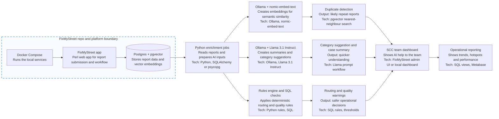

# SCC Incident Analysis AI Automation Simple Flow

This is a simple explanation of the plan, based on `docs/ai-automation-ideas.md`.

The aim is to keep the existing FixMyStreet platform as the core system, and add a local AI support layer around it for:

- duplicate detection
- category suggestion
- short case summaries
- routing and quality warnings
- operational reporting

Everything here is intended to run locally.

That means:

- the platform runs locally in Docker
- the report data lives in local PostgreSQL
- the AI models run locally through Ollama
- the SCC team receives suggestions, but people still make the decisions

## Main chart

## Explicit technology list

- **Docker Compose**: starts the whole local stack.
- **FixMyStreet**: the main reporting application and workflow engine.
- **PostgreSQL**: stores reports, updates, routing data, and workflow data.
- **pgvector**: stores embeddings and performs vector similarity search in Postgres.
- **Python**: runs background enrichment, orchestration, and scoring jobs.
- **psycopg**: lets Python read and write data in PostgreSQL.
- **Ollama**: runs local AI models on the machine.
- **Llama 3.1 Instruct**: generates summaries and helps with category suggestions.
- **nomic-embed-text**: creates text embeddings for duplicate detection and similarity search.
- **SQL rules**: handles deterministic checks such as routing logic, thresholds, and data quality rules.
- **Metabase**: provides a local dashboard and reporting layer.

## What each AI part does

- **nomic-embed-text via Ollama**: turns report text into vectors so similar reports can be found.
- **pgvector**: compares those vectors to find likely duplicates and related cases.
- **Llama 3.1 Instruct via Ollama**: writes short summaries and suggests likely categories.
- **Python rules plus SQL**: flags routing risks, quality issues, and threshold-based warnings.

## Short summary

The FixMyStreet repo stays at the centre of the solution.

Around it, we add a local AI layer using:

- Docker Compose
- PostgreSQL
- pgvector
- Python jobs
- Ollama
- Llama 3.1 Instruct
- nomic-embed-text
- Metabase

So the plan is not to replace the platform.

The plan is to keep the working platform, run everything locally, and add a practical AI support layer for the SCC team.
